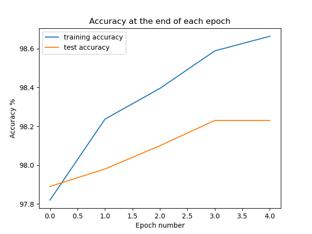

# CG Portfolio Project 2022 

## NON-TECHNICAL EXPLANATION OF YOUR PROJECT

This purpose of this project is to create a convolutional neural network (CNN) to correctly classify handwritten digits of integers in the range 0-9.

The model is then assessed using an accuracy metric. The accuracy metric is a measure of how many times the the images are correctly classified by the CNN out of how many images it has classified in total. 

Once the images have been classified, and an accuracy metric returned, we look to try to improve the model by tuning one of the hyperparameters of the model. In this instance we look to tune the learning rate of the model. The learning rate is a configurable hyperparameter in a neural network, that has a small value between the value of 0.0 and 1.0. The learning rate controls how quickly the model is adapted to the problem. Smaller learning rates require more training epochs, given the smaller changes made to the weights in each update, whereas larger learning rates change the model more rapidly. The number of epochs is the hyperparameter that defines the number of times the learning algorithm will work through the entire training dataset. In this project we only look at tuning the learning rate, and keep the epoch number fixed.

## DATA

The MNIST dataset was created by the National Institute of Standards and Technology (NIST). This is a physical sciences laboratory and non-regulatory agency of the United States Department of Commerce. The MNIST database was created originally in 1998 as a combination of two of NIST's databases: Special Database 1 and Special Database 3. These databases consist of digits written by high school students and employees of the US Census Bureau.

The MNIST Dataset consists of 70k 28x28 pixel grayscale images of handwritten digits extracted from two NIST databases. The training set consists of 60,000 images, and the test set comprises 10,000 images. There is one digit per class with a total of 10 classes (0-9), with 7,000 images in each class.

## MODEL 

The model I have chosen is a convolutional neural network with the following structure:

CONV -> RELU -> MAXPOOL -> CONV -> RELU -> MAXPOOL -> FULLY CONNECTED -> RELU -> FULLY CONNECTED

The reasons for using this model, is because it is not too bulky, relatively easy to follow what is happening at each stage, and it delivers strong results. 

## HYPERPARAMETER OPTIMSATION

The hyperparameter I have chosen to tune is the learning rate. To to this I have used methods from the ray-tune library. I have used PyTorch to write create my CNN.

## RESULTS

The original performance of the CNN resulted in an accuracy of 96.75%, with a learning rate of 0.01, and 5 epochs. 

This performance was improved after performing hyperparameter tuning, and changing the learning rate to 0.0005. This produced an accuracy of 98.130 %.

You can include images of plots using the code below:

## (OPTIONAL: CONTACT DETAILS)
If you are planning on making your github repo public you may wish to include some contact information such as a link to your twitter or an email address. 

